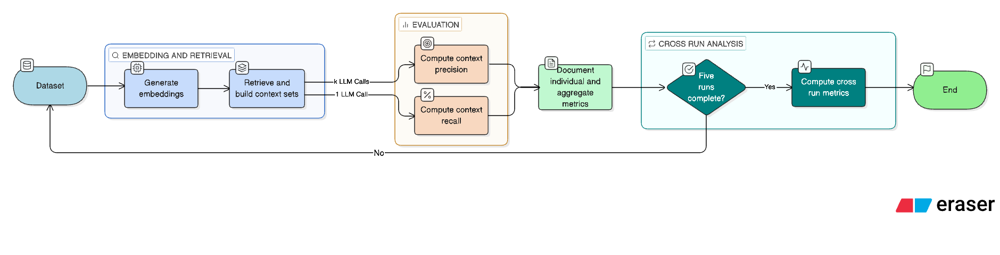

Slides: [slides.html](slides.html){target="_blank"} ( Go to `slides.qmd`
to edit)

## Introduction

Universities are increasingly offering more diverse courses and specialized degree programs, allowing students to tailor their coursework to their interests or career goals. This subsequently increases the complexity of students' advising needs, increasing the load on the university's academic advisers. Advising demand peaks during specific periods, including  registration, drop/add periods, and in the days following final grade issuance. This creates a bottleneck, as there are a fixed number of advisers available to address an increasing number of students' needs. While many universities publish academic policies and degree requirements online, students may wish to verify the applicability of the information to their specific academic situation.

While chatbots have long existed to help serve customers' requests, their performance has been limited by reliance on static information, the inability to synthesize information across many sources or apply context-specific reasoning, as well as the inability to generate natural responses. Recent advancements in large language models, including the ability to dynamically access and synthesize information across multiple sources, understand context and autonomously adjust behavior, and generate conversational responses, present an opportunity to develop an intelligent academic advising assistant. This assistant could augment existing advisers by responding to routine questions and providing personalized guidance, consequently allowing advisers to focus on higher-complexity requests.

Off-the-shelf large language models have increasingly large parametric knowledge bases, though their knowledge is limited to that which they have been exposed to during training. The models do not have access to any information published after their training cutoff date. Despite this, models may attempt to answer a question about information that they were not trained upon, resulting in hallucinated responses. Furthermore, generated responses do not have source information, leaving users unable to verify the accuracy of responses. These limitations are unacceptable in an academic setting. Academic policies, degree requirements, and program offerings change regularly. An intelligent advising assistant must be able to access the most up-to-date information at all times, providing grounded, verifiable responses with clear citations. 

Retrieval-augmented generation (RAG) addresses these limitations by enabling access to non-parametric knowledge, or information retrieved from external information stores at the time of the user's query rather than from within the model's parametric knowledge [@lewis2020retrieval]. This expands the model's memory and reduces hallucinations. The process is as follows: The pre-trained retrieval model encodes the user's query and uses Maximum Inner Product Search (MIPS) to identify the top-K most relevant documents from the document index. The pre-trained generation model then crafts its response based on both the user's original query and the retrieved documents. This architecture overcomes the knowledge-cutoff date problem present in large language models. The model's non-parametric knowledge can be updated simply by encoding and upserting the updated information to the document index. This is a more practical option, as it is computationally less expensive, less time-consuming, and less technically complex than retraining the generation model. 

It is also a more effective architecture, as @lewis2020retrieval prove that the RAG architecture outperforms state-of-the-art models on knowledge-intensive tasks and increases overall RAG pipeline performance by supplementing the generation model's parametric knowledge.  Additionally, this architecture provides transparency in terms of information sources. Whereas parametric knowledge is stored within the model's training weights, information obtained using a retriever has a citation, improving the verifiability of responses. 

Since 2020, the RAG architecture has evolved significantly. @gao2024rag systematically reviewed over 100 RAG-related studies, identifying three technological paradigms: Naive RAG, Advanced RAG, and modular RAG. While they document the numerous optimization techniques that can improve RAG system performance, this review focuses on techniques relevant to the development of an agentic academic adviser.

Naive RAG is identical to the architecture championed by @lewis2020retrieval, though @gao2024rag note that naive RAG systems have three key limitations: retrieval of irrelevant documents, reliance on parametric memory leading to hallucinated answers, and inefficient information synthesis across multiple sources. Advanced RAG implements both pre-retrieval and post-retrieval optimization techniques to overcome the shortcomings of naive RAG. Pre-retrieval optimizations include query optimization strategies, document-index improvements, and embedding optimizations. Query optimization strategies are employed to refine the user's intent before retrieval and include techniques such as utilizing an LLM to break down, expand, or rewrite a user's query. Indexing optimization focuses on how data is structured. Strategies include recursively splitting a document using its structure and overlapping context between chunks, preventing context truncation. Additionally, indexes can utilize hierarchical structures, knowledge graphs, or embedded metadata to capture relationships between data chunks, increasing context to improve the relevancy of retrieved information. The authors' comprehensive review identifies multiple embedding optimization techniques, including hybrid indexing and embedding model fine-tuning. Fine-tuning a model can be computationally expensive and technically rigorous, limiting its applicability. Hybrid indexes, however, are a more accessible alternative, utilizing sparse and dense vector representations to capture both contextual information and exact keyword matching.

@BlendedRAG provide empirical evidence of hybrid indexes' superior performance when compared to state-of-the-art models. The authors explore indexing techniques to improve the retrieval effectiveness of RAG systems, including standard sparse indexing, sparse encoder-based vector models, and dense indexing. Standard sparse indexing, colloquially known as keyword-matching, assigns relevance based upon how many times a keyword appears in a document relative to the entire collection. Sparse-encoder based indexes improve upon traditional sparse indexing by enhancing the vocabulary with semantically similar words, improving the precision of keyword-matches. Finally, dense indexes compare the vectorized form of the user’s query to a collection of vectorized documents, selecting the top-K documents using cosine similarity. This method is efficient for capturing context.  Benchmarking using the NDCG@10 metric, the authors demonstrated that semantic-based hybrid methods consistently outperform both state-of-the-art baselines and keyword-based hybrid methods. The Sparse Encoder-based semantic search, when combined with the 'Best Fields' query, demonstrated superior performance, even when compared to RAG pipelines specifically fine-tuned for those datasets. These findings are particularly relevant in an academic advising context, where users' queries may require contextual understanding, benefiting from dense embeddings, or be better suited by exact keyword-matching, benefiting from sparse embeddings. 

Following retrieval, Advanced RAG also implements post-retrieval optimization techniques, which refine the context prior to generation. In the generation process, the LLM synthesizes the retrieved results into an answer which is returned to the user. @gao2024rag highlight that it is generally not a good idea to return the results as-is and recommend curating the context before returning the information to the user. This may involve re-ranking outputs to ensure that the most relevant answer is provided first. Another post-retrieval technique involves using an LLM to evaluate the content prior to returning an answer to the user.


@gao2024rag identify that robust RAG systems should be able to reject documents which are contextually-relevant but do not contribute substantive information. They should refrain from generating an answer when the returned results are not useful, thus minimizing hallucinations. RAG systems should also be able to synthesize information across multiple documents and identify known inaccuracies. To ensure systems possess these capabilities, @gao2024rag emphasize that RAG systems inherently have two objectives, retrieval and generation, which should be evaluated separately. The retrieved results should be evaluated for precision and recall, while the generated text should be evaluated against the context of what was returned (faithfulness) and its relevancy to the initial query. This enables optimization of specific pipeline components. 

Despite the importance of evaluating the components individually, RAG systems have traditionally been evaluated end-to-end, combining retrieval and generation performance into a single evaluation. To address this limitation, @salemi2024eRAG propose eRAG, a method for evaluating retrieval quality independently. eRAG is a system where the LLM individually processes each document returned by the retriever and generates an answer. Metrics, such as Exact Match or ROUGE, can be employed to generate a utility score based upon the LLM’s ability to answer the user’s query using only that document’s content. The accuracy scores can then be aggregated set-wise, and the retrieved result set can be evaluated using standard metrics, including precision and recall. The authors demonstrate that this method of evaluation is more computationally efficient, reducing runtime complexity from $O(lk^2d^2)$ to $O(lkd^2)$, where k is the number of documents, d is the average length of each document, and l is the length of the generated output. Running the LLM k times, rather than combining all k documents into a single input, helps to avoid the quadratic cost penalty applied by standard transformers to long inputs. Upon evaluation, the authors found that eRAG is 2.5 times faster and significantly more memory-efficient than traditional end-to-end evaluation systems. eRAG also consistently outperformed more traditional systems, including the KILT benchmark and Relevance Annotation with LLM. This technique is directly applicable to the development of an intelligent advisor, during both system development and in production. During development, eRAG is an efficient way to compare retriever performance as different optimization techniques are implemented. In production, it can be used to filter returned text chunks for relevancy and quality, prior to generating a response for the user.

Naive and Advanced RAG pipelines are linear in flow: The system receives the user's query, retrieves the relevant documents and returns them to the LLM, which generates a result. Modular RAG instead provides the capability to alter this flow, in the form of advanced architecture. Building upon the foundational principles of Naive RAG and Advanced RAG, Modular RAG systems aim to improve context, flexibility, and overall efficiency by enabling loops. Techniques include recursive and adaptive retrieval. Recursive retrieval initializes with a complete iteration; however, it then allows the generator LLM to judge the relevance of the most recent results. The LLM may choose to recursively perform the RAG process, applying query improvement techniques as needed to improve the relevancy of results. Finally, adaptive retrieval utilizes fine-tuned LLMs to intelligently decide if the RAG process is necessary [@gao2024rag].

Agentic AI systems possess autonomous planning and decision-making capabilities, as well as the ability to sense changes in their environment and react accordingly, making these systems perfect candidates for implementing both Modular and Advanced RAG techniques. @AgenticAI2025Jagga highlights several core architectural components of agentic systems that are relevant to a RAG-enabled academic advisor. Beginning with perception modules, which serve as the input for sensory information, the author argues that complex modules, or those that utilize transformations to derive contextual meaning from simple inputs, outperform context-free systems in ambiguous scenarios. In the context of this study, this emphasizes the importance of query optimizations, utilizing an agent to enhance or decompose a query, increasing the RAG pipeline's ability to return and generate relevant results. The author's emphasis on accurate, fast, and easy-to-maintain knowledge representation systems is enabled by access to a well-designed RAG knowledge base, utilizing Advanced RAG's index and embedding optimization techniques. The strength of hierarchical design is echoed by both @gao2024rag and @AgenticAI2025Jagga. 

Optimizing an agentic system's planning and reasoning framework involves enabling the agent with hierarchical decomposition or adaptive capabilities. Hierarchical decomposition allows the agent to break a single task into several subsequent tasks. Adaptive agents can adjust their planning mechanism in response to the task [@AgenticAI2025Jagga]. Agentic RAG systems enabled with one or more of these capabilities showcase a modular architecture. An adaptive agent may recognize when the retrieved results are non-substantive and opt to re-retrieve results with an enhanced query, a combination of Modular RAG's recursive retrieval and Advanced RAG's query optimization techniques. This capability also ensures that the systems do not generate a response when presented with non-substantive or non-relevant retrieval results, a key feature of robust systems [@gao2024rag]. Finally, a key advantage of adaptive agentic systems is the ability to include humans in the planning and action stages. @AgenticRAGwHumans note that users may pose specific questions which lack context; advanced users may possess an "implicit understanding that is difficult to articulate or extract." Rather than inputting the raw query to the RAG pipeline, the agent may request feedback for additional information or to clarify assumptions. This is a novel application of Advanced RAG's pre-processing techniques in an agentic, modular context.

In the context of a RAG-enabled agentic advisor, one or more of the agent's action execution mechanisms (tools) will be devoted to the execution of the RAG pipeline, including user query embedding and retrieval of the top-K most similar documents from the document index. Agentic systems, particularly those with adaptive capabilities, incorporate Modular RAG's adaptive retrieval, as the agent can autonomously decide whether to call the RAG tool(s) depending upon the user's query. Adaptive agents also add an additional layer of error handling, as the agent can intelligently choose to re-execute an action mechanism with the same or different arguments, depending upon the error message. This, in combination with incorporating robust error-handling into the agents' tools, helps to ensure a reliable, agentic advisor system.

Agentic systems can contain one or more agents chained together, with research indicating that a well-designed multi-agent system can outperform a monolithic system [@AgenticAI2025Jagga]. Multi-agent systems may utilize a hierarchical architecture, where a higher-level agent delegates tasks to a lower-level agent, allowing for agent specialization and efficient resource allocation.  Consensus-based coordination excels in scenarios with high uncertainty, allowing agents to reach a consensus based on collective decision-making. In the context of a RAG architecture, a centralized agent may designate RAG-related tasks to one or more RAG-enabled agents. Consensus-based coordination may be used to determine the quality of the retrieved context prior to generating a response for the user, utilizing scoring metrics or re-ranking algorithms. This is an agentic implementation of Advanced RAG's post-processing techniques.

The reviewed literature comprehensively documents the RAG architecture and recent advancements to include Naive RAG, Advanced RAG, Modular RAG, Agentic RAG, and human-in-the-loop architectures. In these studies, performance was systematically evaluated using common benchmarking datasets and metrics; however, limited research exists which evaluates the application of Advanced RAG or Modular RAG techniques in agentic systems, specifically one employed in a domain-specific application. Furthermore, 


**Look into discussing https://aclanthology.org/2025.magmar-1.2.pdf - Single agent multi-modal, no published metrics.*

### Sentences that I've typed and will probably use somewhere

In this study, knowledge base documents were chunked based on document structure, then on chunk size, enabling a 20% context overlap. This study also implemented metadata enrichment. Source hierarchy and header information were injected into chunk content to improve dense embeddings and increase retrieval precision.

 This study expands upon both @gao2024rag and @BlendedRAG, implementing a hybrid index, which utilizes dense embeddings and sparse-encoded embeddings.

This research aims to implement techniques from both Advanced RAG and Modular RAG technological paradigms in an agentic context, utilizing different agentic architectures to identify which combination of techniques provides the optimal performance in an academic environment. 

____


## Methods

-   Detail the models or algorithms used.

-   Justify your choices based on the problem and data.

### Knowledge Base Development

The RAG pipeline's knowledge base is comprised of content from the University of West Florida's Public Knowledge Base and the Department of Mathematics and Statistics' 2024-2025 Graduate Student Handbook. More information about the sourced data, including the raw data ingestion and data pre-processing methods applied, can be found in the [Data Exploration and Visualization](### Data Exploration and Visualization) section below. Once ingested, both document sources utilized the same chunking and indexing strategies detailed below. 

#### Chunking Strategy

The corpus utilizes a hierarchical-recursive chunking strategy. Each page was split on headers, using LangChain's MarkdownHeaderTextSplitter method. While initial iterations split on Level 1 through level 4 headers, the strategy was refined to split on Level 1 through 2 headers following baseline testing, preventing overly-granular chunks. Headers were retained within each chunk's content, rather than stripped. This retains critical labels which add semantic context, increasing the likelihood of retrieval.

Then, LangChain's RecursiveCharacterTextSplitter method was used to split each chunk recursively, with a 2000 character-limit and a  400-character (20%) sliding window overlap. This ensures each chunk has adequate context, without obscuring specific details which may be needed for factual queries. The sliding window also helps to preserve context across split texts. This strategy is in alignment with industry best practices [@2025chunkingbps]. Each chunk was assigned a custom, deterministic ID, using either the Confluence Page ID for pages scraped from the knowledge base or the document title for ad hoc documents. 

The applicable metadata was extracted from each chunk. For adhoc documents, this includes the source document's file name, the chunk ID, and the header hierarchy. For documents scraped from UWF's Confluence tree, metadata also included the page's path (for nested documents), URL, version number, and last updated date. These were attached to each chunk as metadata prior to upsertion, enabling easy filtering if needed. The metadata was also prepended for content enrichment, prior to vectorization, providing additional context for the retriever to use when retrieving relevant information.

** Insert Metadata / Context Before/After Here **


#### Indexing Strategy

#### Embedding Process

#### Vector Upsertion

### RAG Pipeline Performance Testing and Optimization

As encouraged by @gao2024rag, the RAG pipeline's retriever and generator were tested independently. Independent testing allows for more nuanced diagnostics and targeted improvements. Poor retriever performance may be improved by optimizing the knowledge base's data-preparation and indexing strategies, or by applying query pre-processing techniques. Improving retriever performance should subsequently improve generation performance; however, post-retrieval techniques, such as re-ranking or context compression, may also help to improve generation performance. Model fine-tuning was considered out of scope for this project.

#### RAG Retriever Testing

Improving the quality of content returned from the vector store subsequently improves the entire pipeline's performance, thus great care was taken to optimize the RAG retriever. Retriever testing was performed on three 50-question, independent datasets, withholding one 50-question dataset for final testing. The other two datasets were used for pipeline optimization. 

The Ragas Python library was used to evaluate the retriever's performance, using two critical metrics: Context Precision and Context Recall [@ragas_api_reference]. Both methods implement LLM-as-a-judge; OpenAI's gpt-4o model was utilized, balancing high reasoning capabilities with lower cost, when compared to newer models such as gpt-5. The model was invoked with temperature = 0.0, to ensure the results were as deterministic and repeatable as possible.

Precision focuses on the relevancy of the returned results and is computed as the ratio of relevant chunks to total chunks. Retrievals which return a larger amount of relevant chunks will consequently have a higher ratio and return a higher score. Context Precision accounts for the order with which results are retrieved. For each chunk, it multiplies the running precision at chunk k by a binary relevance indicator, $v_k$, where 1 is relevant and 0 is an irrelevant chunk. This is then summed and divided by the total number of relevant chunks. It is calculated as follows: $$\text{Context Precision} = \frac{\sum_{k=1}^{K}(\text{Precision@k} * v_k)}{\text{Total Number of Relevant Items in K Results}}$$ [@ragas_context_precision]. For example, if the retriever returned 5 total results, 3 of which were deemed by the LLM to be relevant. The relevant chunks were placed at positions 1, 3 and 5 respectively. Overall precision is $\frac{3}{5}$. The Context Precision is then: $$\frac{(\frac{1}{1} * 1) + (\frac{1}{2} * 0) + (\frac{2}{3} * 1) + (\frac{2}{4} * 0) + (\frac{3}{5} * 1)}{3} = 0.76 $$

Context recall is simpler in that it evaluates whether all of the relevant content, broken into individual claims, was retrieved [@ragas_context_recall]. $$\text{Context Recall} = \frac{\text{Number of ground truth claims supported by the retrieved contexts}}{\text{Total number of claims in the ground truth}}$$ A higher score indicates that more of the ground truth was retrieved.

The pipeline process is as follows:

* Generate embeddings for each query using the pinecone-sparse-english-v0 model (sparse-encoded) and gemini-embeddings-001 (dense). This is consistent with the models utilized to develop the knowledge base.
* Retrieve the top-k results, where k is specified at the time of testing. For a dataset with 50 questions, where k = 5 results were retrieved, this produces a set of 50 question / context sets, where each context set contains the k = 5 retrieved chunks.
* Evaluate the retriever's performance, computing Context Precision and Context Recall for each question and associated context set. Context Precision calls the Ragas LLM (gpt-4o) k times, one for each retrieved chunk, whereas Context Recall calls the Ragas LLM once per question. 
* Document individual scores and compute aggregrate metrics across the dataset.
* Repeat five times per model iteration, documenting cross-run metrics (average and standard-deviation) for comparison.



Because both Context Precision and Context Recall utilize LLM-as-a-judge, repeating the pipeline over a specific number of iterations is important for ensuring that the results are consistent and repeatable.

The testing process is resource intensive. Testing a dataset of 50 questions, retrieving k=5 results per question, requires 400 total API calls:

- 50 calls to Sparse Embedding Model
- 50 calls to Dense Embedding Model
- 300 calls to Ragas LLM:
  - 250 calls for Context Precision (5 per question)
  - 50 calls for Context Recall (one per question)
  
Running the pipeline for a single model iteration makes 2000 total API calls. 500 API calls to the Embedding Models, 1500 API calls to a generative LLM.

The pipeline utilizes Ragas v0.4 Collections API and the asyncio Python library to perform asynchronous Ragas metric computation. Though the pipeline makes k API calls for each question, the calls are performed nearly simultaneously, significantly reducing the time it takes to execute the pipeline.

#### RAG Retriever Optimization


#### RAG Generation Testing


## Analysis and Results

### Data Exploration and Visualization

#### RAG Knowledge Base Dataset

#### Performance Evaluation Dataset


### RAG Pipeline Performance Analysis

Using the methodology performed above, the RAG retriever's performance was evaluated 

-   Describe your data sources and collection process.

-   Present initial findings and insights through visualizations.

-   Highlight unexpected patterns or anomalies.

A study was conducted to determine how...

```{r, warning=FALSE, echo=T, message=FALSE}
# loading packages 
library(tidyverse)
library(knitr)
library(ggthemes)
library(ggrepel)
library(dslabs)
```

```{python}
import pandas as pd
```

```{r, warning=FALSE, echo=TRUE}
# Load Data
kable(head(murders))

ggplot1 = murders %>% ggplot(mapping = aes(x=population/10^6, y=total)) 

  ggplot1 + geom_point(aes(col=region), size = 4) +
  geom_text_repel(aes(label=abb)) +
  scale_x_log10() +
  scale_y_log10() +
  geom_smooth(formula = "y~x", method=lm,se = F)+
  xlab("Populations in millions (log10 scale)") + 
  ylab("Total number of murders (log10 scale)") +
  ggtitle("US Gun Murders in 2010") +
  scale_color_discrete(name = "Region")+
      theme_bw()
  

```

### Modeling and Results

-   Explain your data preprocessing and cleaning steps.

-   Present your key findings in a clear and concise manner.

-   Use visuals to support your claims.

-   **Tell a story about what the data reveals.**

```{r}

```

### Conclusion

-   Summarize your key findings.

-   Discuss the implications of your results.

## References

