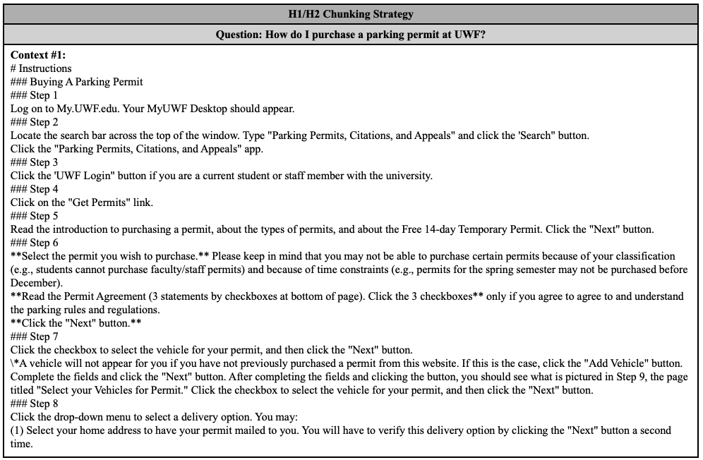
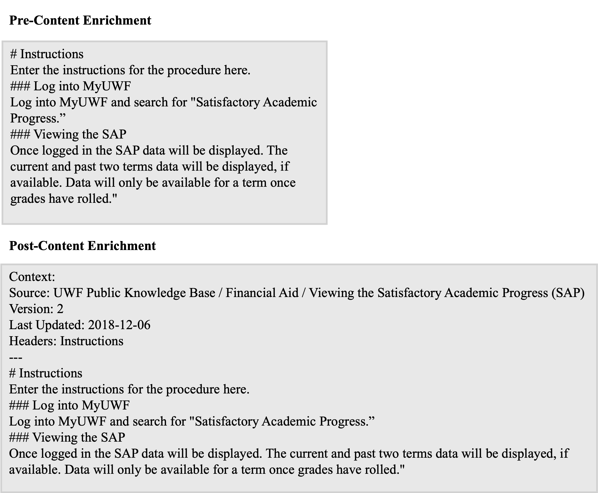
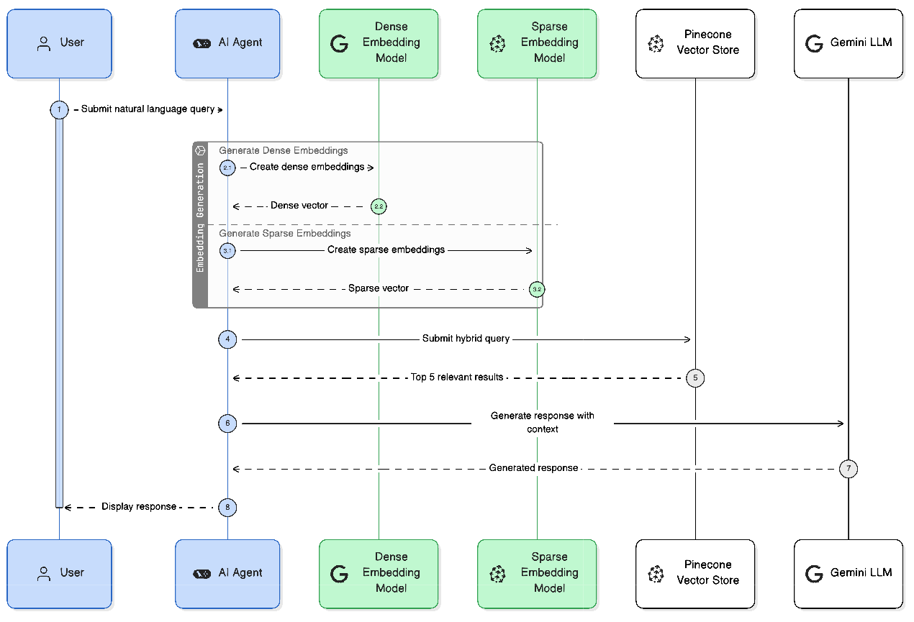

## Introduction {.smaller}

-   Universities increasingly offer diverse courses and specialized
    degree programs, increasing the complexity of students’ advising
    needs. This creates bottlenecks during peak demand periods.
-   In an academic setting, where policies and degree requirements
    change regularly, responses must be grounded, verifiable, and
    up-to-date.
-   Off-the-shelf LLMs are limited by their training cutoff date and may
    hallucinate responses to queries about information not in their
    training data [@ji2023hallucination].
-   Retrieval-Augmented Generation (RAG) addresses these limitations by
    enabling access to non-parametric knowledge retrieved from external
    knowledge stores at query time, overcoming the knowledge-cutoff
    problem and providing transparency through direct citation of
    retrieved content [@lewis2020retrieval]
-   Agentic AI systems add autonomous planning and decision-making on
    top of the RAG architecture [@AgenticAI2025Jagga]. Using a ReAct
    (Reason-Act-Observe) framework [@yao2022react], an agent can
    autonomously implement both Advanced and Modular RAG techniques,
    deciding when to retrieve, rewrite queries, and iteratively refine
    results. This is a significant advantage over naive RAG pipelines
    [@gao2024rag].

## The Evolution of RAG Architecture {.smaller}

-   **Naive RAG:** The foundational architecture that connects an LLM to
    an external knowledge base. However, its linear flow suffers from
    three key limitations: the retrieval of irrelevant documents,
    reliance on parametric memory (leading to hallucinations), and
    inefficient information synthesis across multiple sources
    [@gao2024rag].

-   **Advanced RAG:** Overcomes Naive RAG's limitations by implementing
    pre-retrieval and post-retrieval optimization techniques. Key
    pre-retrieval strategies include query optimization (e.g., rewriting
    or expanding queries), hierarchical document-index improvements, and
    embedding optimizations like hybrid indexing [@gao2024rag].

-   **Modular RAG:** Transitions the pipeline from a linear flow to an
    advanced, adaptable architecture. It improves context and efficiency
    by enabling recursive retrieval loops, where the LLM judges result
    relevancy and iterate, and adaptive retrieval, which intelligently
    decides if the RAG process is even necessary for a given prompt
    [@gao2024rag].

## Project Goal {.smaller}

-   Bridge the gap in existing literature by implementing and evaluating
    Advanced and Modular RAG techniques within a single-agent,
    domain-specific deployment.

-   Enable the agent with the architectural foundations needed to
    autonomously employ Advanced and Modular RAG techniques without
    requiring explicit infrastructure.

-   **Research Question:** What data preparation and hybrid indexing
    strategies optimize retrieval performance for an agentic RAG system?

## Knowledge Base Data Ingestion {.smaller}

-   The corpus was sourced from the UWF Public Knowledge Base
    (Confluence API) and the Graduate Student Handbook (PDF).

-   Confluence data was programmatically scraped using a depth-first
    search of the internal XML structure (`body.storage`), avoiding the
    extraction of messy rendered HTML.

-   XML was parsed and cleansed using `BeautifulSoup` to strip noise
    (macros, empty layouts) before conversion to clean Markdown using
    `Markdownify`.

-   The Handbook PDF was parsed directly into Markdown format using
    LangChain's `DoclingLoader`.

-   Scraped pages retained their ancestor chains and key metadata (e.g.,
    version number, timestamp), which were prepended to the Markdown
    files as YAML frontmatter to retain context.

## Knowledge Base Development: Chunking & Indexing {.smaller}

-   Employed a hierarchical-recursive chunking strategy.

-   Initially, texts were split on Level 1 through 4 headers; however,
    early testing indicated that this resulted in overly granular
    chunks, causing reduced performance.

-   Pivoted to Level 1 through 2 header splitting, preserving procedural
    context and improving performance.

-   Each chunk had a 2,000-character limit with a 20% sliding window
    overlap to prevent context truncation [@2025chunkingbps].

-   Use-case: An 11-step procedure was previously split over 11 steps.
    This strategic pivot then resulted in the entire procedure being
    split over only two chunks.

## Knowledge Base Development: Chunking & Indexing {.smaller}

## Knowledge Base Development: Chunking & Indexing {.smaller}

## Knowledge Base Development: Context Enrichment {.smaller}

Text chunks were enriched with metadata (source path, header hierarchy)
prior to vectorization to improve contextual similarity scoring.

## Knowledge Base Chunk Filtering {.smaller}

Rule-based filtering removed noisy placeholders and LLM-enabled
intelligent filtering (`Claude Haiku 4.5`) removed non-substantive
"Overview" stubs, improving system performance.

## Knowledge Base Indexing {.smaller}

-   Vectors were stored in a unified Pinecone hybrid index, proven to
    demonstrate superior performance when compared to state-of-the-art
    models [@BlendedRAG].

-   `gemini-embedding-001` was utilized for dense semantic embeddings,
    which captures broad contextual information.

-   `pinecone-sparse-english-v0` was utilized for sparse embeddings,
    enabling exact keyword-matching.

-   Applied Euclidean normalization to scale vector magnitudes to 1.0,
    ensuring dense and sparse embeddings maintained equal weighting
    during dot-product similarity comparison.

## Knowledge Base Vector Normalization {.smaller}

## Knowledge Base Processing and Ingestion Pipeline {.smaller}

## Agentic RAG Process {.smaller}

-   The system utilizes a command-line AI agent built on the `LangGraph`
    framework, powered by OpenAI’s `gpt-5`, enabling state persistence,
    multi-turn memory, and recursive loops.

-   Operating on a ReAct (Reason-Act-Observe) architecture
    [@yao2022react], the agent autonomously decides when to trigger the
    knowledge base retrieval tool based on user input.

-   The agent dynamically employs Advanced RAG pre-retrieval techniques
    by evaluating, rewriting, or expanding ambiguous user queries prior
    to executing the search.

-   Mirroring Modular RAG techniques, the agent evaluates the retrieved
    context in its updated state and can iteratively refine its query
    for re-retrieval if the initial results lack substantive answers.

## Agentic RAG Process {.smaller}

## Agentic RAG Process {.smaller}

## RAG Retriever Evaluation Pipeline {.smaller}

-   **Evaluation Scope:**

    -   Strictly scoped to the RAG retriever to directly assess the
        impact of data ingestion, chunking, and indexing optimizations
        independent of the generation phase.

    -   The Pinecone retriever received the queries exactly as written.
        The independent retriever pipeline did not utilize the AI Agent
        architecture.

-   **Testing Datasets:** Utilized two independent, synthetically
    generated 50-question datasets (a Development Set for iterative
    tuning and a Holdout Test Set for final validation) created via
    `Claude Haiku 4.5`.

-   **LLM-as-a-Judge:** Metric computation relied on an automated
    LLM-as-a-judge methodology utilizing OpenAI's `gpt-4o`.

-   **Pipeline Reliability:** To ensure consistency and minimize LLM
    variability, the automated asynchronous pipeline executed five
    independent runs per design iteration, computing metrics across
    \~2,000 total API calls per cycle.

## RAG Retriever Evaluation Metrics {.smaller}

**Performance Metrics:** Quantified using the `Ragas` framework to
measure:

-   **Context Precision:** Computes relevancy of the retrieved chunks,
    relative to the order in which they were retrieved
    [@ragas_context_precision]. It is computed as follows:
    $$\frac{\sum_{k=1}^{K}(\text{Precision@k} * v_k)}{\text{Total Number of Relevant Items in K Results}}$$

-   **Context Recall:** Evaluates whether all of the relevant content,
    broken into individual claims, was retrieved
    [@ragas_context_recall]. It is computed as follows:
    $$\frac{\text{Number of ground truth claims supported by the retrieved contexts}}{\text{Total number of claims in the ground truth}}$$

## RAG Retriever Evaluation Pipeline {.smaller}

.png)

## Data Exploration {.smaller}

-   The final corpus consisted of 788 total ingested documents: 1
    comprehensive PDF (UWF 2024-2025 Department of Mathematics and
    Statistics Graduate Student Handbook) and 787 scraped Confluence
    pages.

-   As chunking and filtering strategies were iteratively optimized, the
    total number of generated chunks was strategically reduced to
    eliminate noise and context fragmentation.

| Strategy                  | Number of Chunks: |
|---------------------------|-------------------|
| Baseline                  | 5386              |
| H1/H2                     | 4091              |
| H1/H2 with Stub Filtering | 3764              |

: Knowledge Base Chunking Strategy - Chunking Breakdown.
{#tbl-chunk-size-breakdown}

## Results: Development Dataset {.smaller}

-   Iterative indexing optimizations tested against the 50-question
    development set yielded significant performance gains.

-   By adjusting the chunking strategy to focus strictly on Level 1 and
    2 headers and implementing stub filtering, Average Context Recall
    improved by 11% (from a 0.78 baseline to 0.89). Average Context
    Precision also saw steady improvement, increasing by 3% (from a 0.74
    baseline to 0.77).

    | Pipeline Design Iteration | Average Context Recall | Average Context Precision |
    |:-----------------------:|:---------------------:|:-----------------------:|
    |         Baseline          |      0.78 ± 0.00       |        0.74 ± 0.01        |
    |  H1/H2 Chunking Strategy  |      0.85 ± 0.00       |        0.74 ± 0.01        |
    |  H1/H2 + Stub Filtering   |      0.89 ± 0.00       |        0.77 ± 0.01        |

    : Testing Results - Development Dataset. {#tbl-dataset1-testing-res}

-   The consistently low standard deviation across all metrics and
    pipeline configurations (≤ 0.01) indicates that the LLM-as-a-judge
    evaluation
    is stable and repeatable.

## Results: Holdout Dataset {.smaller}

-   To validate the improvements observed, the system was evaluated
    against the holdout testing set. Because the pipeline's design was
    strictly tuned using the development set, performance on the holdout
    set represents the system's true expected performance.

    | Pipeline Design Iteration | Average Context Recall | Average Context Precision |
    |:-----------------------:|:---------------------:|:-----------------------:|
    | Optimized Pipeline (H1/H2 + Stub Filtering) | 0.97 ± 0.00 | 0.83 ± 0.01 |

    : Testing Results - Holdout Dataset. {#tbl-holdout-testing-res}

-   Evaluation demonstrated strong generalization and pipeline
    consistency.

-   These results confirm that the hybrid index and chunking
    optimizations reliably surface highly relevant context, even for
    unseen procedural queries.

-   The low standard deviation observed across five independent
    runs (≤ 0.01) is consistent with the stability observed during
    development dataset evaluation.

## Conclusion {.smaller}

-   **Conclusion:** Academic advising is an information-rich field where
    policies change frequently, making it a perfect use case for an
    agentic RAG system built on a ReAct architecture.

<!-- -->

-   **Future Work (Generation Evaluation):** While this research
    rigorously isolated the retriever, future iterations should evaluate
    the end-to-end generation component using metrics like Faithfulness
    and Answer Relevancy.

-   **Future Work (Tool Expansion):** The agent’s capabilities could be
    expanded by integrating additional tools, such as live web search,
    allowing it to dynamically retrieve updated information if the
    embedded metadata indicates a stored policy is outdated.

## References
